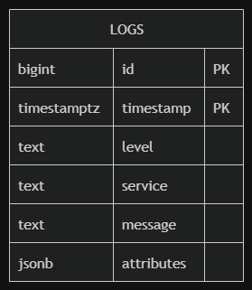
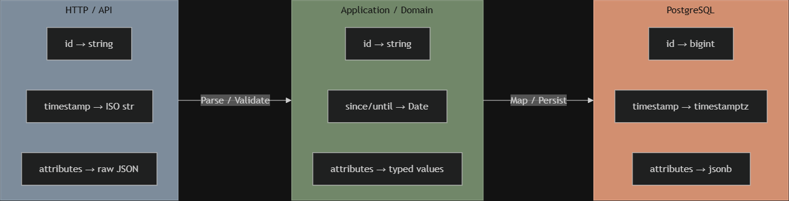
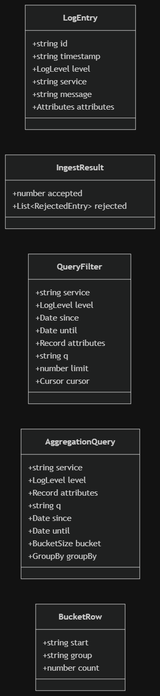
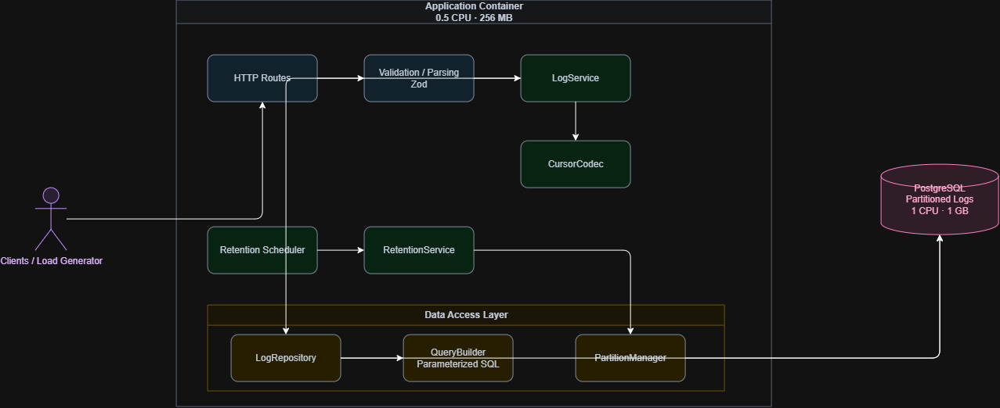
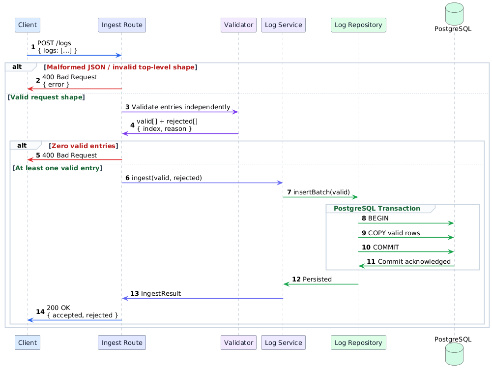
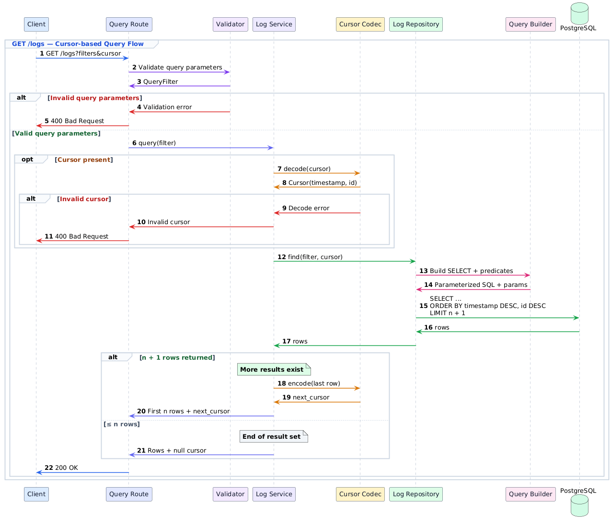
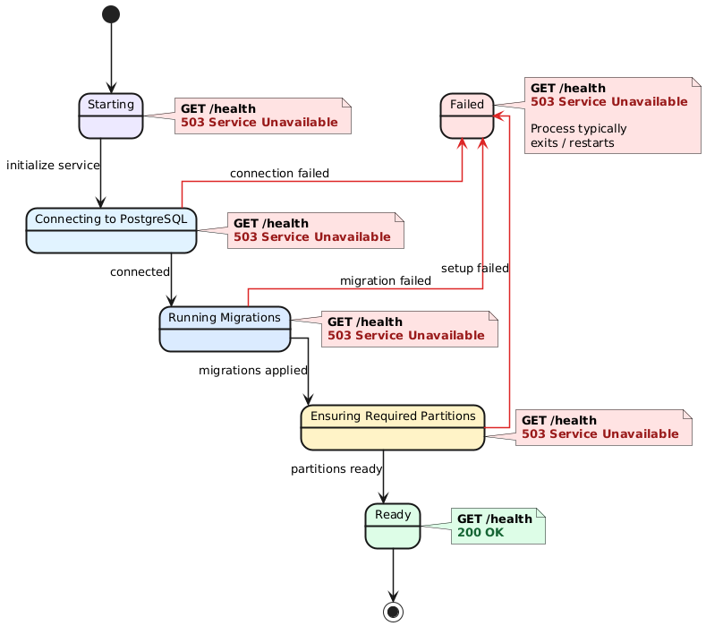
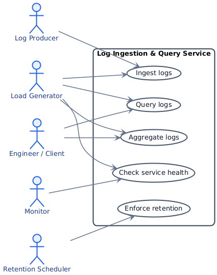

# Log Ingestion & Query Service — Design & Analysis

Companion to `requirements.md`. This document records how the service is built and why each decision was made. 

## Table of contents

1. [Performance budget (the math)](#1-performance-budget-the-math)
2. [Data model & schema](#2-data-model--schema)
3. [Attribute storage strategy](#3-attribute-storage-strategy)
4. [Index strategy](#4-index-strategy)
5. [Retention strategy](#5-retention-strategy)
6. [Query design & resilience under load](#6-query-design--resilience-under-load)
7. [Domain model](#7-domain-model)
8. [Architecture (layered)](#8-architecture-layered)
9. [Flows (sequence diagrams)](#9-flows)
10. [Startup & health](#10-startup--health)
11. [Use cases](#11-use-cases)
12. [Known limitations & deferred features](#12-known-limitations--deferred-features)

---

## 1. Performance budget (the math)

**Constants:** One CPU core delivers 1000 ms of CPU time per wall-clock second.

| Resource | App (0.5 CPU) | Postgres (1.0 CPU) |
|----------|---------------|--------------------|
| CPU time / sec | 500 ms | 1000 ms |
| RAM | 256 MB | 1 GB |

Working estimates (to be verified by measurement): a log ≈ 300 bytes serialized;
`fsync` ≈ sub-ms to a few ms of **storage latency** (not CPU); HTTP request overhead ≈ tens of µs of CPU.

**The one law:** `throughput = resource ÷ cost_per_unit`, rearranged to
`budget_per_unit = resource ÷ target`.

### 1.1. CPU budget

| Derivation | Result |
|-----------|--------|
| App CPU / log = 500 ms ÷ 15,000 | **~33 µs / log** |
| Postgres CPU / log = 1000 ms ÷ 15,000 | **~67 µs / log** |

These are **average CPU budgets per log** required to *sustain* 15k/s — and the 33 µs must cover
the **entire per-log pipeline**: HTTP handling, JSON parsing, validation, serialization, and the
DB driver. The sharp conclusion: **15k/s leaves almost no CPU headroom in the app container**
(15,000 × 33 µs ≈ 495 ms of the 500 ms available), so per-log work must be minimal. On Postgres,
the 67 µs must also be *shared* with WAL, index maintenance, vacuum, and concurrent queries — so
it is even tighter than it looks.

### 1.2. Batching (mandatory, but not free)

| Batch size B | Requests/sec = 15,000 ÷ B |
|--------------|---------------------------|
| 1 | 15,000 |
| 100 | 150 |
| 1000 | 15 |

Per-log HTTP overhead is only affordable when amortized across a large batch, so **request-per-log
is infeasible on this budget** and batching is mandatory. But batching consumes memory: a
1000-log batch is ~300 KB raw, and in-memory JS objects are several times larger (object + string
overhead). With only 256 MB in the app, the design **bounds the batch / request-body size and
avoids holding multiple copies** of a batch; the working batch size is chosen by **measurement**,
not by "always maximize".

### 1.3. Durability (a latency budget, not CPU)

`fsync` is an **I/O / durability latency** cost, separate from the CPU budget. A durable
`COMMIT` (with `synchronous_commit=on`) waits for the required WAL flush before returning success, so **row-per-commit
is latency-bound to well below 15k/s**. Batching amortizes this: one commit per ~1000-row batch
drops the durable-commit rate to ~15/s, making per-commit durability latency far less dominant than it would be with row-per-commit. (The commit→fsync
mapping is not strictly 1:1 — WAL group commit can coalesce concurrent commits — but the
direction holds: fewer, larger commits win.) **`synchronous_commit=off` is rejected** — it risks
losing acknowledged rows on crash, violating *"never return 200 for a batch not durably persisted."*

### 1.4. The write path (`COPY`)

`COPY` is preferred because it minimizes per-row protocol/statement overhead and gives Postgres a
**streaming bulk-ingestion path**; multi-row `INSERT` is a middle ground; row-per-statement is far
too slow. As rough orders of magnitude (**to be established by benchmark under this project's CPU,
RAM, WAL, index, and concurrency constraints, not treated as guarantees**): row-per-commit is expected to be durability-bound; multi-row INSERT amortizes statement overhead; COPY provides the lowest per-row ingestion overhead. With **partial acceptance**, the flow is:
validate each entry → `COPY` only the valid rows → single durable commit → return per-entry result.

### 1.5. Query-side budget (the concurrent pressure)

The read targets — aggregation **p95 < 1 s** and **≥ 1 aggregation/sec** — must be met
**concurrently with 15k/s ingestion on Postgres's single core**. Ingestion, WAL, index
maintenance, vacuum, *and* aggregation all contend for that one CPU. This contention — not raw
table size — is the real reason index restraint and aggregation design matter.

### 1.6. RAM implications

- **App (256 MB):** bounds batch size; process valid rows in a bounded buffer and feed them to COPY, avoiding unnecessary duplicate representations of the full batch; avoid multiple copies of a batch.
- **Postgres (1 GB):** shared across `shared_buffers`, `work_mem`, connections, and vacuum — so `work_mem` stays modest and the connection pool small.

### 1.7. Sustained target vs. storage sizing

1M rows is the required stored-data scale; at 15k/s the resident dataset forms in ~67 s under test. The ~0.4
logs/sec *monthly average* is relevant only to **storage/retention sizing** — it does **not**
soften the requirement: 15k/s is a **sustained performance target** (the spec says *"Sustain"*).

**Conclusions (the ingestion recipe):**

`
large batches (size by measurement)  +  COPY  +  only indexes justified by a required read  +  durable batched commit
`

Time partitioning is **not** part of this throughput recipe — it is a separate decision driven
primarily by **retention and query pruning** (see §5), not by ingestion throughput.

---

## 2. Data model & schema

The `logs` table is range-partitioned by `timestamp` (see §5 for the partition-interval decision):

```sql
CREATE TABLE logs (
  id          bigint       GENERATED ALWAYS AS IDENTITY,
  timestamp   timestamptz  NOT NULL,
  level       text         NOT NULL,        -- validated in the app; CHECK constraint optional
  service     text         NOT NULL,
  message     text         NOT NULL,
  attributes  jsonb        NOT NULL DEFAULT '{}',
  PRIMARY KEY (timestamp, id)               -- composite; must include the partition key
) PARTITION BY RANGE (timestamp);

-- one partition per interval, pre-created by migration / maintenance (see §5)
CREATE TABLE logs_2026_08_10 PARTITION OF logs
  FOR VALUES FROM ('2026-08-10') TO ('2026-08-11');
```



The primary key is the **composite** `(timestamp, id)` — `id` is not a standalone PK.

Decisions:

- **`PRIMARY KEY (timestamp, id)`** satisfies the partitioned-table requirement (the PK must
  include the partition key) **and** doubles as the sort + keyset-cursor index: its btree is
  scanned backward to serve `ORDER BY timestamp DESC, id DESC`. No separate ordering index needed.
  `id` acts as the deterministic tiebreaker when rows share a `timestamp`.
- **Index locality caveat.** For normally ordered timestamps, inserts tend to append near the
  right edge of the relevant partition's btree, keeping index maintenance relatively efficient.
  **Late or out-of-order timestamps reduce this locality** — this is not an unconditional
  "append is cheap" guarantee.
- **`timestamp` is the event time** (client-supplied), not ingestion time. This is why late /
  backdated logs are possible and why partitioning + retention semantics are tied to event time
  (see §5).
- **`level text`** (not an enum): the storage saving of an enum is negligible here, while an enum
  couples level changes to schema migrations. Validation lives in the app; a `CHECK` constraint is
  an option if a fixed list is desired.
- **`id` is `bigint` in the DB, serialized as `string` at the API boundary** (JS integer precision
  beyond 2^53) — a serialization decision, not a UUID.
- **`attributes jsonb`** — storage/query strategy is decided in §3; no attribute index by default.

---

## 3. Attribute storage strategy

**The decision the spec calls the most important one.**

### What the contract actually requires

`attr.<key>=value` — **equality only**, **compared as strings**. No ranges, no numeric
comparison, no sorting on attributes. This narrows the design space sharply: attributes never
need indexing for anything but string equality.

### The elegant fit: `->>` gives string semantics

Postgres `->>` extracts a JSONB value **as text regardless of stored type**:

| Stored | `attributes->>'k'` | `attr.k=...` matches |
|--------|--------------------|-----------------------|
| `{"retries": 3}` | `'3'` | `attr.retries=3` |
| `{"active": true}` | `'true'` | `attr.active=true` |
| `{"user_id": "42"}` | `'42'` | `attr.user_id=42` |

So `attr.retries=3` becomes `WHERE attributes->>'retries' = '3'`. Note the precise mechanism:
`->>` itself converts to text; what **preserves the original JSON types in the response** is that
the raw `attributes` value is **stored unchanged** and used directly for output, while `->>` is
used only for the comparison. String-comparison contract satisfied, types preserved in responses,
no normalization required.

### Options compared

| Option | Write cost @ 15k/s | Attr query speed | Storage | Verdict |
|--------|--------------------|------------------|---------|---------|
| **EAV** (separate key/value table) | Catastrophic — one extra row per attribute; even a modest average attribute count creates substantial row amplification (e.g. 5/log → ~75k rows/s) | OK but join-heavy | High | Rejected — amplification breaks the ingest budget |
| **JSONB + GIN** | Expensive — one index entry per key/value per row | Fast (`@>`), but type-sensitive | Large index | Query-optimized, fights 15k/s and complicates string semantics |
| **JSONB, no index (`->>` + time)** | Cheap — heap + timestamp btree only | Good for time-bounded queries; **potentially expensive for unbounded attribute-only queries** | Minimal | **Chosen baseline** |

### Decision

**Baseline: raw `jsonb` + `->>` equality, no GIN.** Justification, tied to §1:

1. **15k/s is the binding constraint** — each index is a write tax we avoid unless proven necessary.
2. **Time is the natural primary filter for the required query patterns.** When a query includes a
   time range, partition pruning and the timestamp ordering index bound the candidate set before
   the attribute predicate is evaluated. **Attribute-only queries remain potentially expensive**
   because `->>` has no index by default — this is an explicit baseline trade-off, not an oversight.
3. **`->>` matches the string-comparison contract** and the raw JSONB preserves response types.

**Escalation (only if measurement proves the baseline misses a required target) — and only in a
form that preserves string-equality semantics:**
- **Hot-key expression index** for demonstrated hot keys: `CREATE INDEX ON logs ((attributes->>'user_id'))`. Specific query → specific index; preferred when hot keys are few.
- **Normalized-attribute index:** a write-time text-normalized representation of the attributes (e.g. a separate normalized JSONB column produced by the application or another verified DB mechanism), GIN-indexed and queried with `@>` on string values. This is **not** a trivial `GENERATED` expression — normalizing arbitrary JSONB to all-text is non-trivial, so it stays an escalation option, not a baseline.

A naive `GIN(attributes)` + `@>` is **avoided** because JSONB containment is type-sensitive
(`{"retries":3}` ≠ `{"retries":"3"}`) and would break the string-comparison contract. Any future
GIN-based design must be **benchmarked under sustained ingestion and concurrent queries**; index
mechanics such as `fastupdate` do not by themselves establish that GIN can meet the 15k/s target
or the 20-second queryability requirement.

---

## 4. Index strategy

Principle: *every index must justify its write amplification against a required read pattern.* The
goal is not "fewest indexes" but the minimum set needed to satisfy required queries, since each
index is maintained on every insert against the 15k/s budget.

| Index | Serves | Status |
|-------|--------|--------|
| `PK (timestamp, id)` | ordering, keyset pagination, time-range scans | **Required** — provided by the PK; no additional index needed |
| `(service, timestamp DESC, id DESC)` | `service` + time/order queries | **Conditional** — add only if benchmark shows the PK scan is insufficient (and `service` is selective enough to help) |
| Attribute **expression** index (hot keys) | hot `attr.<key>=value` queries | **Conditional** — only for demonstrated hot keys and only where string-equality semantics are preserved |
| GIN on **normalized** attributes | broader attribute equality | **Deferred** — only after benchmark, and only with a string-normalized representation (never naive `GIN(attributes)`) |
| Trigram GIN on `message` | substring `q` search | **Deferred / avoided** — heavy on writes; reconsider only if required query patterns cannot meet p95 without it |

- The PK index is **not free** (it has storage, write-amplification, and maintenance cost) — but
  since the PK is required, no *additional* index is needed for ordering/pagination.
- **Partition-local indexes:** because the table is partitioned, indexes on the parent propagate as
  per-partition indexes. Partition pruning + a partition-local index scan is what makes time-bounded
  queries fast.
- **A naive `GIN(attributes)` cannot be a drop-in optimization** — see §3; it does not preserve the
  `->>` string-equality contract.

**Operating rule:** start with the primary-key index only. Every additional index must be justified
by a measured query pattern and evaluated against the 15k/s ingestion target. Benchmark **both** the
read improvement and the write amplification **under concurrent ingestion**, using
`EXPLAIN (ANALYZE, BUFFERS)` for the query and the project load generator for end-to-end write cost —
a query-only benchmark cannot reveal write cost.

---

## 5. Retention strategy

Retention granularity = partition size. **Daily partitions**, chosen from the numbers:

| Partition size | Partitions / month | Rows / partition (monthly-average) | Verdict |
|----------------|--------------------|-------------------------------------|---------|
| Hourly | ~720 | ~1,400 | Too many — planning/catalog overhead on 1 CPU/1GB |
| **Daily** | ~30–35 | ~33,000 | Negligible planning cost; small under normal load |
| Weekly | ~4–5 | ~230,000 | Coarser retention; less sub-day pruning |

`Rows/partition are based on the **expected average** ingestion rate (~0.4/s), **not** the 15k/s`

`stress rate — under a sustained burst a single day's partition can be far larger.`

**Why `DROP` over `DELETE`.** Dropping a whole partition **avoids the long-running row-level
deletion and table-bloat costs of a large `DELETE`** (and the accompanying autovacuum pressure and
ingestion contention). `DROP` itself still takes a brief lock, so the claim is "no row-by-row
deletion / no bloat", not "no locks at all".

**Mechanism — partition creation is kept OUT of the ingestion hot path.** The partition manager has
two responsibilities, run at startup/migration and by a periodic maintenance job:

1. **Ensure required partitions exist** — the current partition, a configurable look-ahead window,
   and **at least the next partition**, covering the retention window plus the allowed 5-minute
   future skew (so a valid near-future timestamp can cross a day boundary without DDL on the hot
   path).
2. **Drop partitions** whose entire time range is outside the retention window.

The ingestion path **assumes required partitions are pre-created** — it does not run `CREATE
TABLE ... PARTITION OF` synchronously. Introducing DDL (catalog updates, partition-creation locks)
into the 15k/s path would contradict §1's "keep the hot path minimal."

**Retention precision.** Whole daily partitions are dropped, so retention is enforced at **daily
granularity** — expired data may remain until the next maintenance run, with up to roughly one
partition (~1 day) of slack. The README states this rather than claiming exact-timestamp retention.

**Old-timestamp policy (open — resolve from the contract).** The spec bounds timestamps in the
*future* (≤5 min) but sets **no lower bound**, so a valid entry could carry a timestamp older than
any provisioned partition. Because creating arbitrary historical partitions during ingestion would
put DDL in the hot path, this needs an **explicit policy**, not synchronous partition creation:
- *If such entries must be persisted:* handle them through a bounded **cold-path** mechanism separate from normal ingestion.
- *If the retention policy permits discarding data older than the window:* reject/expire them under a **stated** policy (not inferred from the retention config).

In practice the load generator's data spans ~1 month ≈ the retention window, so provisioning the
full window plus margin means this case should not arise during grading; it is documented rather
than solved with hot-path DDL. A near-empty `DEFAULT` partition is a possible last-resort safety
net, but only while it stays empty — once it receives data, adding the matching daily partition
later requires reconciling the rows already in `DEFAULT`, so it is not a free fallback.

---

## 6. Query design & resilience under load

How queries stay fast **and** degrade gracefully while ingestion runs at 15k/s:

1. **Time-bounded queries depend on the requested window, not the total dataset.** Partition pruning
   removes irrelevant partitions and the timestamp btree handles ordering + keyset pagination within
   the relevant partitions. This is a *workload bound*, not a constant-cost guarantee — a narrow
   window under a burst can still contain many rows (1 hour × 15k/s = 54M).
2. **Unbounded filtered queries are worst-case.** When no selective predicate index exists, Postgres
   can scan the `(timestamp, id)` index newest-first and apply the remaining predicates as filters,
   stopping once `limit` matches are found. This is efficient when matches are common and recent, but
   can degrade to a large scan when matches are rare or absent (e.g. a rare `attr` or `q` value with
   no time bound).
3. **Keyset pagination, not OFFSET.** `WHERE (timestamp, id) < (:cursor_ts, :cursor_id) ORDER BY
   timestamp DESC, id DESC LIMIT :n` avoids scanning and discarding all preceding rows as OFFSET
   grows; work remains bounded by index traversal plus the requested page size. The deterministic
   `(timestamp, id)` tiebreak keeps the cursor correct when many rows share a timestamp.
4. **Bounded work.** `limit` defaults to 100, max 1000 — no unbounded result sets.
5. **Fewest justified indexes → ingestion stays ahead.** If writes fall behind, the whole system
   degrades. Lean indexing protects stability, not just write speed.
6. **Hot partition cache-friendliness (hypothesis).** ~33k rows is ~10 MB of raw payload, small
   enough to be cache-friendly under normal load — but the actual table/index footprint depends on
   row layout, JSONB size, and page overhead, and a burst can enlarge the active partition. Treated
   as a measured optimization, not a guarantee.
7. **Small, bounded connection pool.** A deliberately small pool, initially in the low single digits
   and tuned by benchmark. A large pool is avoided because many sessions competing for one Postgres
   CPU increase context switching and reduce throughput. Excess requests queue in the app.
8. **`statement_timeout`.** Caps query execution time so pathological requests cannot consume
   database resources indefinitely.
9. **Backpressure (contract-consistent).** If the service cannot safely sustain ingestion under
   overload, bounded admission / backpressure is preferred to unbounded queue growth. The exact HTTP
   behavior (e.g. 429/503 + `Retry-After`) must remain consistent with the API contract and is not
   invented here.
10. **Rollup tables (fallback).** If aggregation p95 fails under concurrent writes, pre-aggregated
    per-bucket counts turn query cost from O(rows) into O(buckets) — **but only viable when the
    aggregation dimensions are stable and known; arbitrary filter combinations can make a rollup
    strategy too large or complex.** Measurement-driven, not default.

**Ideal query shape** (partition pruning + keyset in one plan):

```sql
WHERE timestamp >= :since
  AND timestamp <  :until
  AND service = :service                       -- optional predicates as present
  AND (timestamp, id) < (:cursor_ts, :cursor_id)
ORDER BY timestamp DESC, id DESC
LIMIT :n;
```

The `QueryBuilder` assembles exactly the predicates present, all as positional parameters.

---

## 7. Domain model

Three representations of the same data, kept explicit:



```typescript
type LogLevel = 'debug' | 'info' | 'warn' | 'error';

type AttrValue = string | number | boolean;
type Attributes = Record<string, AttrValue>;

interface LogEntry {
  id: string;
  timestamp: string;          // ISO 8601 in responses
  level: LogLevel;
  service: string;
  message: string;
  attributes: Attributes;     // original JSON types preserved
}

interface RejectedEntry { index: number; reason: string; }   // free-text reason per contract
interface IngestResult  { accepted: number; rejected: RejectedEntry[]; }

interface Cursor { timestamp: string; id: string; }
// Serialized as an opaque base64 cursor token at the API boundary.
type CursorToken = string;

interface QueryFilter {
  service?: string;
  level?: LogLevel;
  since?: Date;                          // inclusive
  until?: Date;                          // exclusive
  attributes?: Record<string, string>;   // compared as strings; optional
  q?: string;
  limit: number;                         // 1..1000, default 100
  cursor?: Cursor;
}
interface QueryResult { logs: LogEntry[]; next_cursor: CursorToken | null; }

type BucketSize = '1m' | '5m' | '1h' | '1d';
type GroupBy = 'service' | 'level';
interface AggregationQuery {
  service?: string;
  level?: LogLevel;
  attributes?: Record<string, string>;
  q?: string;
  since: Date;                           // required
  until: Date;                           // required
  bucket: BucketSize;
  groupBy?: GroupBy;
}
interface BucketRow { start: string; group: string | null; count: number; }  // group null when groupBy omitted
```



Note the deliberate asymmetry: query-side attributes are `Record<string,string>` (compared as
strings via `->>`), while `LogEntry.attributes` preserves original JSON types in the response.
`Cursor` (the `(timestamp, id)` payload) is distinct from `CursorToken` (its opaque base64 form at
the boundary).

---

## 8. Architecture (layered)

Dependencies flow downward; shared utilities such as cursor encoding and SQL construction are
isolated behind narrow interfaces so business and transport layers never build SQL directly.



Responsibilities:

- **HTTP Routes** — thin transport: parse the request, invoke a service, map the result to an HTTP response. No SQL, no business logic.
- **Validation** — validate request structure and query parameters; validate each log entry independently; preserve the original batch index for rejected entries; normalize validated input into application types.
- **LogService** — orchestrate ingestion and querying; coordinate partial acceptance; call repository methods; decode incoming cursors and encode outgoing ones; hold application-level rules.
- **RetentionService** — compute the retention cutoff; decide which partitions should exist or be removed; invoke `PartitionManager`. No SQL/DDL.
- **LogRepository** — persistence abstraction for logs: `COPY` ingestion, query and aggregation execution; delegates dynamic SQL construction to `QueryBuilder`. No HTTP concerns.
- **PartitionManager** — create/ensure required partitions and drop expired ones; owns partition DDL; safe under concurrent maintenance.
- **QueryBuilder** — construct dynamic SQL predicates using positional parameters exclusively; never interpolate user-controlled values; keep SQL construction centralized and auditable.
- **CursorCodec** — encode/decode the `(timestamp, id)` payload; produce opaque tokens; reject malformed cursors.
- **RetentionScheduler** — trigger maintenance periodically; timing concerns only, no retention policy logic.

**Security boundary.** All dynamic values are passed as PostgreSQL positional parameters; no
user-controlled value is interpolated into SQL text. `QueryBuilder` centralizes dynamic predicate
construction so this rule is auditable in one place. The boundary is *parameterization*, not a class
name — SQL injection is disqualifying.

---

## 9. Flows

### Ingestion path

`COPY` provides throughput; the explicit `BEGIN → COPY → COMMIT` transaction is the
atomicity/durability boundary. `COPY` alone is not a durability mechanism.



The `200` response is emitted only after PostgreSQL acknowledges the durable commit. If the

transaction fails, those entries are not reported as accepted.

### Query path (with cursor)

The **n+1 trick** computes `next_cursor`: fetch one extra row; if present, encode it and drop it.
SQL is built inside the repository via `QueryBuilder` — the service never builds SQL.



---

## 10. Startup & health

`GET /health` **exists throughout startup** and reports readiness — it returns `503` until the
service is ready and `200` only after the database is connected, migrations are applied, and the
required partitions exist. This gates the load generator from sending traffic too early.



"Required partitions ready" means the current partition plus the look-ahead/retention window from
§5 — not just the current partition. On a startup failure the process typically exits and is
restarted by the orchestrator rather than lingering in a degraded state.

---

## 11. Use cases



The Load Generator exercises the core ingestion, query, aggregation, and health paths under the
required performance workload. Human clients and monitoring systems exercise the same application
capabilities outside the benchmark environment. `Enforce retention` is the only system-triggered
use case; it runs independently of external client requests.

---

## 12. Known limitations & deferred features

**Deferred unless measurement proves the need:** attribute-specific indexes or a normalized
attribute index, the `(service, timestamp, id)` composite index, and rollup tables. These are
intentionally excluded from the baseline because every additional index or write-side structure
consumes CPU, memory, WAL, and maintenance budget on the 1-CPU PostgreSQL container.

**Deferred by scope decision:** authentication, multi-tenancy, rate limiting, dashboard, live-tail,
alerting, compression, and custom query language. These are outside the core scope and remain
disabled by default, so a bare `docker compose up` yields the plain core service.

**Accepted trade-offs to document after measurement:**

- Attribute values are compared as strings, matching the contract. Numeric/range predicates on attributes are not supported.
- `q` substring search uses `ILIKE` within the selected time window rather than a trigram index. This intentionally trades read performance for lower ingestion and index-maintenance cost, and can be expensive for unbounded `q` queries.
- Query performance depends on the time window, not just dataset size. Time-bounded queries benefit from partition pruning; `/logs` filters without `since`/`until` (e.g. a rare `service`, attribute, or `q` value) may require large scans and are not guaranteed to remain fast.
- Retention is enforced at daily-partition granularity. Expired data may remain until the next retention-maintenance run, with up to roughly one partition (~1 day) of granularity.
- Valid logs with arbitrarily old timestamps require an explicit policy (cold-path persistence or documented rejection) rather than synchronous partition creation on the ingestion hot path.
- `statement_timeout` and connection-pool size start from conservative values and are tuned by benchmark rather than derived directly from the requirements.