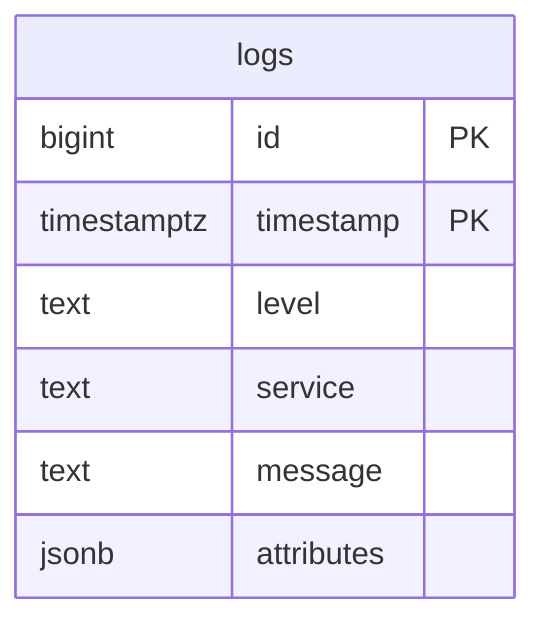
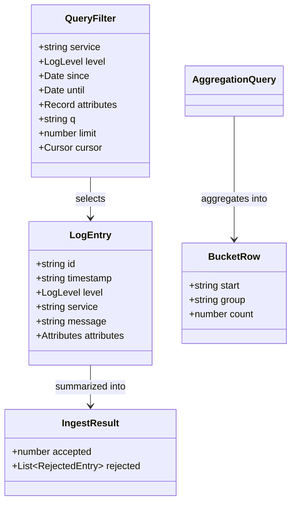
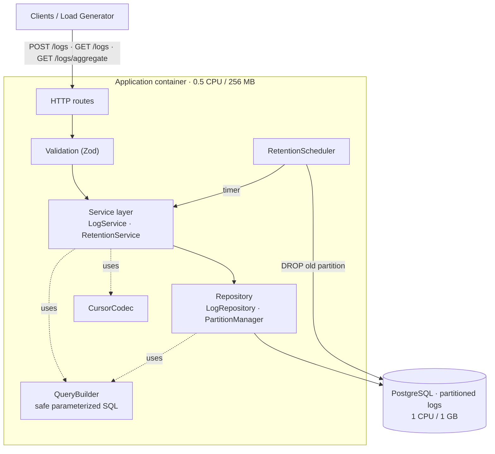
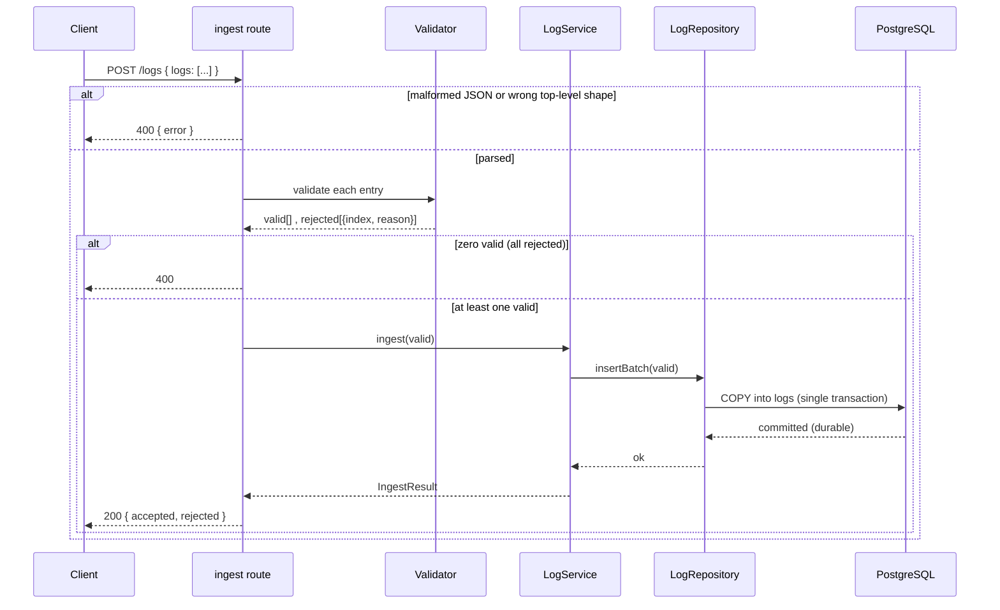
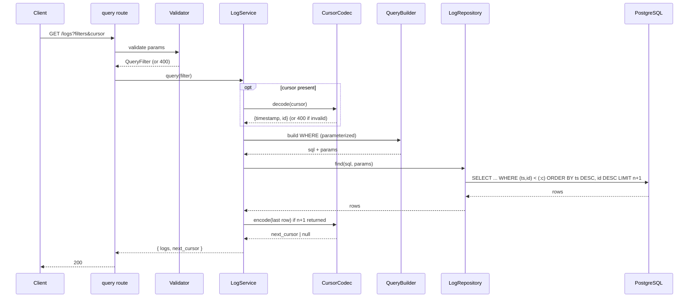
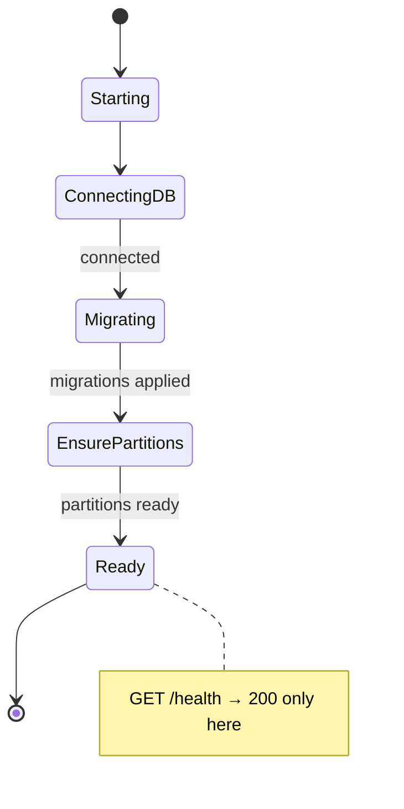
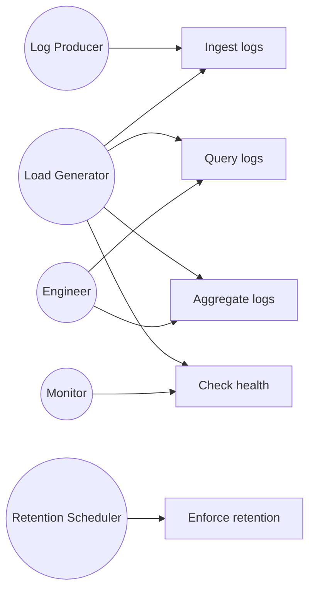

# Log Ingestion & Query Service — Design & Analysis

> Companion to `requirements.md`. This document records **how** the service is built
> and **why** each decision was made. All diagrams are Mermaid and render natively on GitHub.
>
> Core framing: this is a **performance-engineering** task, not a CRUD app. Every decision
> below is derived from the resource budget, not from intuition.

## Table of contents

1. [Performance budget (the math)](#1-performance-budget-the-math)
2. [Data model & schema](#2-data-model--schema)
3. [Attribute storage strategy](#3-attribute-storage-strategy)
4. [Index strategy](#4-index-strategy)
5. [Retention strategy](#5-retention-strategy)
6. [Query design & resilience under load](#6-query-design--resilience-under-load)
7. [Domain model](#7-domain-model)
8. [Architecture (layered)](#8-architecture-layered)
9. [Flows (sequence diagrams)](#9-flows)
10. [Startup & health](#10-startup--health)
11. [Use cases](#11-use-cases)
12. [Known limitations & deferred features](#12-known-limitations--deferred-features)

---

## 1. Performance budget (the math)

**Constants.** One CPU core delivers 1000 ms of CPU time per wall-clock second.

| Resource | App (0.5 CPU) | Postgres (1.0 CPU) |
|----------|---------------|--------------------|
| CPU time / sec | 500 ms | 1000 ms |
| RAM | 256 MB | 1 GB |

Working estimates (to be verified by measurement): a log ≈ 300 bytes serialized;
`fsync` ≈ 1 ms (the durability tax); HTTP request overhead ≈ tens of µs of CPU.

**The one law:** `throughput = resource ÷ cost_per_unit`, rearranged to
`budget_per_unit = resource ÷ target`.

| Derivation | Result | Consequence |
|-----------|--------|-------------|
| App CPU / log = 500 ms ÷ 15,000 | **33 µs / log** | Request-per-log is impossible; batching is mandatory |
| Postgres CPU / log = 1000 ms ÷ 15,000 | **67 µs / log** | Every index eats into this budget |
| Requests/sec at batch B = 15,000 ÷ B | B=1 → 15,000; B=1000 → 15 | Large batches amortize HTTP + fsync overhead |
| fsync/sec (1 commit/batch) = 15,000 ÷ B | B=1 → 15,000 (impossible); B=1000 → 15 (trivial) | Batch commits, don't commit per row |
| Fill time for 1M rows @ 15k/s | ~67 s | 15k/s is a **burst** stress; ~0.4/s is the real monthly average |

**Conclusions (the architectural recipe):**

```
large batches  +  COPY  +  fewest possible indexes  +  time partitioning  +  durable commit
```

- **Batching is not an optimization — it is the line between possible and impossible**, from two independent angles (HTTP overhead and fsync).
- **`COPY` over row-by-row `INSERT`:** order-of-magnitude difference. Row-by-row (commit per row) ≈ 1k rows/s (fsync-bound); multi-row INSERT ≈ 20k/s; `COPY` ≈ 80k/s. `COPY` leaves **headroom** that index maintenance, vacuum, and concurrent queries then consume.
- **No `synchronous_commit=off`:** it risks losing acknowledged rows on crash → violates *"never return 200 for a batch not durably persisted."* Get throughput from batching instead (15 commits/s, not 15,000).

---

## 2. Data model & schema

The `logs` table is **range-partitioned by `timestamp`** (daily partitions).

```sql
CREATE TABLE logs (
  id          bigint       GENERATED ALWAYS AS IDENTITY,
  timestamp   timestamptz  NOT NULL,
  level       text         NOT NULL,        -- alternative: enum for compactness
  service     text         NOT NULL,
  message     text         NOT NULL,
  attributes  jsonb        NOT NULL DEFAULT '{}',
  PRIMARY KEY (timestamp, id)               -- must include the partition key
) PARTITION BY RANGE (timestamp);

-- one partition per day, pre-created by migration / maintenance job
CREATE TABLE logs_2026_08_10 PARTITION OF logs
  FOR VALUES FROM ('2026-08-10') TO ('2026-08-11');
```



**Why `PRIMARY KEY (timestamp, id)`:** partitioned tables require the partition key in any
unique constraint. This PK also creates a btree index that Postgres can scan **backward** to
serve `ORDER BY timestamp DESC, id DESC` — so it **doubles as the sort + keyset-cursor index**,
and no separate index is needed. On append-only data, inserts hit the right edge of the btree
(cheap).

---

## 3. Attribute storage strategy

**The decision that the spec calls the most important one.**

### What the contract actually requires

`attr.<key>=value` — **equality only**, **compared as strings**. No ranges, no numeric
comparison, no sorting on attributes. This drastically narrows the design space: we never need
to index attributes for anything but string equality.

### The elegant fit: `->>` gives string semantics for free

Postgres `->>` extracts a JSONB value **as text regardless of its stored type**:

| Stored | `attributes->>'k'` | Query `attr.k=...` matches |
|--------|--------------------|-----------------------------|
| `{"retries": 3}` | `'3'` | `attr.retries=3` ✅ |
| `{"active": true}` | `'true'` | `attr.active=true` ✅ |
| `{"user_id": "42"}` | `'42'` | `attr.user_id=42` ✅ |

So `attr.retries=3` becomes `WHERE attributes->>'retries' = '3'` — matching the *"compared as
strings"* contract exactly, **with no normalization**, and **preserving original types in the
response**. The only cost: `->>` is not index-backed by default.

### Options compared

| Option | Write cost @ 15k/s | Attr query speed | Storage | Verdict |
|--------|--------------------|------------------|---------|---------|
| **EAV** (separate key/value table) | Catastrophic — ~5 extra rows/log ≈ 60k rows/s | OK but join-heavy | High | ❌ Rejected — row amplification breaks the ingest budget |
| **JSONB + GIN** | Expensive — one index entry per key/value per row | Excellent (`@>`) | Large index | Query-optimized, fights 15k/s |
| **JSONB, no index (`->>` + time)** | Cheap — heap + timestamp btree only | Excellent *when time-bounded*, risky for unbounded attr-only queries | Minimal | ✅ **Chosen baseline** |

### Decision

**Baseline: raw `jsonb` + `->>` equality, no GIN, relying on time as the primary filter.**
Justification, tied to the budget:

1. **15k/s is the binding constraint** — each index is a write tax we avoid unless proven necessary.
2. **Time is the natural primary filter** — aggregation requires `since`/`until`; `/logs` sorts by time, paginates, and defaults `limit=100`. After partition pruning + the timestamp btree, the candidate set is small and the attribute filter is a cheap recheck.
3. **`->>` matches the contract** and preserves types.

**Escalation (measurement-driven):** if an unbounded attribute-only query fails p95, add an
index — **but not a naive switch to `@>`.** JSONB containment is *type-sensitive*:
`attributes @> '{"retries":"3"}'` matches only a stored string `"3"`, and
`@> '{"retries":3}'` only a stored number `3`. That contradicts the *"compared as strings"*
contract, under which `attr.retries=3` must match a stored `3` **or** `"3"`. So the escalation
must **preserve string semantics**, e.g.:
- a generated column holding all values normalized to text (`attributes_text jsonb`), GIN-indexed and queried with `@>` on string values — keeps raw `attributes` for the response; **or**
- expression indexes on specific hot keys (`CREATE INDEX ON logs ((attributes->>'user_id'))`) when the hot keys are known.

Postgres GIN `fastupdate=on` defers index work to a pending list, so burst-time write cost is
lower than it looks, and the 20-second queryability window absorbs the lag. The specific index
type is chosen **after** benchmarking, and only one that preserves string-equality semantics.
Documented as a trade-off rather than adopted by default.

---

## 4. Index strategy

Principle evaluated explicitly: *indexes aligned with query patterns.* Each index added is
maintained on every insert, so it is a measurable ingestion cost.

| Index | Serves | Status |
|-------|--------|--------|
| `PK (timestamp, id)` | main sort, keyset pagination, time-range scans | **Always** (free from PK, backward-scannable) |
| `(service, timestamp DESC, id DESC)` | hot `/logs?service=` over wide windows | Add **only if** measurement shows it's needed |
| `GIN (attributes)` | unbounded attribute queries | Add **only if** measurement shows it's needed |
| trigram GIN on `message` | `q` substring | Avoided — heavy write cost; rely on scan within the time window |

Start minimal, measure with `EXPLAIN ANALYZE`, add indexes only against demonstrated need.

---

## 5. Retention strategy

Retention granularity = partition size. **Daily partitions**, chosen from the numbers:

| Partition size | Partitions / month | Rows / partition | Verdict |
|----------------|--------------------|--------------------|---------|
| Hourly | ~720 | ~1,400 | Too many — planning/catalog overhead on 1 CPU/1GB |
| **Daily** | ~30–35 | ~33,000 (monthly-average) | ✅ Negligible planning cost; small partitions under normal load |
| Weekly | ~4–5 | ~230,000 | Coarse retention; less sub-day pruning |

**Mechanism.** The partition manager has **two distinct responsibilities**, run at
startup/migration and by a periodic job:
1. **Ensure future + in-window partitions exist** for `[now − RETENTION_DAYS − margin, now + buffer]` (the `+buffer` covers the allowed 5-minutes-in-the-future timestamps and day-boundary rollover).
2. **Drop expired partitions** past the window. `DROP` is an O(1) metadata operation — **no row-by-row `DELETE`, no long locks, no table bloat, no autovacuum storm, no contention with ingestion.**

`RETENTION_DAYS` is configurable via env var (default e.g. 30).

**Retention precision.** Because whole daily partitions are dropped, retention is enforced at
**daily granularity** — up to ~1 day of older-than-`RETENTION_DAYS` data can remain until the
next drop. The README states this rather than claiming exact-timestamp retention.

**Old-timestamp edge case (must not fail a valid entry).** The spec bounds timestamps in the
*future* (≤5 min) but sets **no lower bound**, so a valid entry could carry a timestamp older
than any provisioned partition — and Postgres rejects an insert with no matching partition.
Resolution: on ingest, group the batch by day and **lazily ensure each needed partition exists**
before `COPY` (guarded by an advisory lock so concurrent workers don't race on the DDL). This
never fails a valid entry and avoids a `DEFAULT` partition, which would otherwise be scanned on
every time-range query and blunt pruning. (A near-empty `DEFAULT` partition remains an acceptable
*fallback* safety net if lazy DDL proves too costly under load — its pruning tax is negligible
while it stays empty.) The chosen approach is verified under the load test.

---

## 6. Query design & resilience under load

How queries stay fast **and don't fail** while ingestion runs at 15k/s:

1. **Time-bounded queries are size-independent — unbounded ones are not.** When `since`/`until` are given, partition pruning + timestamp btree make scanned data depend on the *requested window*, not total retained data. But `/logs` filters are all optional: `GET /logs?service=api`, `?q=error`, or `?attr.user_id=42` with **no** time bound is valid. Those walk the `(timestamp DESC, id DESC)` index newest-first until `limit` matches are found — fast when the value is common/recent, but **worst-case a large scan when the value is rare**. Unbounded filtered queries are explicitly treated as worst-case benchmark scenarios, not guaranteed-fast paths.
2. **Keyset pagination, not OFFSET.** `WHERE (timestamp, id) < (:cursor_ts, :cursor_id) ORDER BY timestamp DESC, id DESC LIMIT :n` is O(limit) at any depth; OFFSET re-scans everything before it. The deterministic `(timestamp, id)` tiebreak is what makes the cursor correct even when many rows share a timestamp.
3. **Bounded work.** `limit` defaults to 100, max 1000 — no unbounded result sets.
4. **Fewest indexes → ingestion stays ahead.** If writes fall behind, backpressure (429/503) and CPU starvation degrade *reads* too. Lean indexing protects whole-system stability.
5. **Hot partition in cache (hypothesis, not guarantee).** Under the monthly-average workload a daily partition is ~33k rows and sits comfortably in `shared_buffers`. But during a burst test, ~1M rows can land in a **single** day's partition (if their timestamps cluster on one day), so the active partition may be far larger than 33k. Cache residency is therefore a *measured optimization*, verified per test, not a structural guarantee.
6. **Small, bounded connection pool.** A large pool thrashes a 1-CPU server via context switching, so the pool is kept small and bounded (a starting point near the core count, then tuned by benchmark — the optimal number depends on query duration, batch size, and concurrent aggregation load). Excess requests queue in the app.
7. **`statement_timeout`.** Caps worst-case queries so a pathological request fails fast instead of hanging and blocking ingestion — graceful degradation *is* part of "doesn't fail under load."
8. **Rollup tables (fallback).** If aggregation p95 fails under concurrent writes, pre-aggregated per-bucket counts turn query cost from O(rows) into O(buckets). Measurement-driven, not default.

---

## 7. Domain model

TypeScript types are the concrete domain model:

```typescript
type LogLevel  = 'debug' | 'info' | 'warn' | 'error';
type AttrValue = string | number | boolean;
type Attributes = Record<string, AttrValue>;

interface LogEntry {
  id: string; timestamp: string; level: LogLevel;
  service: string; message: string; attributes: Attributes;
}

interface RejectedEntry { index: number; reason: string; }
interface IngestResult  { accepted: number; rejected: RejectedEntry[]; }

interface Cursor      { timestamp: string; id: string; }        // opaque, base64
interface QueryFilter {
  service?: string; level?: LogLevel;
  since?: Date; until?: Date;                                    // inclusive / exclusive
  attributes: Record<string, string>;                           // compared as strings
  q?: string; limit: number; cursor?: Cursor;
}
interface QueryResult { logs: LogEntry[]; next_cursor: string | null; }

type BucketSize = '1m' | '5m' | '1h' | '1d';
type GroupBy    = 'service' | 'level';
interface AggregationQuery {
  service?: string; level?: LogLevel;
  attributes: Record<string, string>; q?: string;
  since: Date; until: Date; bucket: BucketSize; groupBy?: GroupBy;
}
interface BucketRow { start: string; group: string | null; count: number; }
```



Note the deliberate asymmetry: `QueryFilter.attributes` is `Record<string,string>` (query
compares as strings), while `LogEntry.attributes` preserves original types in the response.

`id` is `bigint` in the database but `string` at the API boundary — a **serialization decision**,
not a UUID: JavaScript numbers lose integer precision beyond 2^53, so bigints are serialized as
strings to stay safe. (The DB keeps `bigint` for compact, sequential, append-friendly keys.)

---

## 8. Architecture (layered)

Each layer depends only on the one below. This is evaluated as *separation of concerns* and
makes the code testable and the SQL swappable without touching HTTP.



Responsibilities:

- **HTTP routes** — thin: parse, call service, format response. No SQL.
- **Validation** — per-entry log validation and query-param validation; returns rejection reasons with original indices.
- **LogService** — business logic: orchestrates validation + persistence, builds `IngestResult`, encodes/decodes cursors.
- **RetentionService** — computes cutoff, drops expired partitions.
- **LogRepository** — the only place that knows SQL: `COPY` ingest, `find`, `aggregate`, partition management.
- **QueryBuilder** — builds dynamic `WHERE` with **parameterized placeholders only** (`$1, $2, …`). Single security boundary → *SQL injection is disqualifying* is enforced in one auditable place.
- **CursorCodec** — base64 encode/decode of `(timestamp, id)`; rejects malformed cursors (400).

---

## 9. Flows

### Ingestion path

The durability rule lives at one point: **commit before 200**. Keep the two roles distinct —
`COPY` provides **throughput** (bulk write path), while the **durable `COMMIT`** is the
atomicity/durability boundary that actually satisfies *"never 200 for a batch not durably
persisted."* `COPY` alone is not a durability mechanism.



### Query path (with cursor)

The **n+1 trick** computes `next_cursor`: fetch one extra row; if present, encode it and drop it.



---

## 10. Startup & health

`GET /health` returns 200 **only** after the service is truly ready — this gates the load
generator from sending traffic too early.



---

## 11. Use cases



The Load Generator touches all four data/health use cases — if the service works for it, it
works for every real user. `Enforce retention` is the only system-triggered use case.

---

## 12. Known limitations & deferred features

**Deferred unless measurement proves the need:** GIN index on attributes, `(service, …)`
composite index, rollup tables.

**Deferred by scope decision:** authentication, multi-tenancy, rate limiting, dashboard,
live-tail, alerting, compression, custom query language. All optional per the contract; all
off by default so a bare `docker compose up` yields the plain core service.

**Accepted trade-offs to document after measurement:**
- Attribute values are compared as strings (matches the contract); numeric/range predicates on attributes are not supported.
- `q` substring uses `ILIKE` within the time window rather than a trigram index (write-cost trade-off).
- **Query performance depends on the time window, not just dataset size:** time-bounded queries are fast via partition pruning; `/logs` filters *without* `since`/`until` (e.g. a rare `service`, `attr`, or `q` value) are worst-case scans, not guaranteed-fast.
- **Retention is enforced at daily-partition granularity** — up to ~1 day beyond `RETENTION_DAYS` may persist until the next partition drop.
- `statement_timeout` and connection-pool size are chosen starting values, tuned by benchmark rather than derived from requirements.